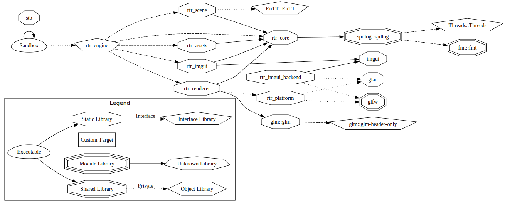

# RTR-Engine
Real-Time 3D Only Renderer Engine/Sandbox

> [!NOTE]
> To compile and run the program you need to download Ninja, vcpkg (and set the env variable VCPKG_ROOT), Git,
> CMake and C/C++ compiler.  
> 
> To run the Engine-Debug preset:  
> ```bash
> cmake --preset Engine-Debug
> cmake --build --preset build-debug
> ./out/build/Engine-Debug/Sandbox/Sandbox
> ```

>  [!WARNING]
> Currently only supports OpenGL 4.6.
> Older hardware and macOS does not support 4.6 in Client mode, however it should work in a headless configuration, as a server if needed.

Inspiration from:  
* [TheCherno](https://www.youtube.com/@TheCherno):
* Game Engine series [(YT-Playlist)](https://www.youtube.com/playlist?list=PLlrATfBNZ98dC-V-N3m0Go4deliWHPFwT)   -   [Github: Hazel](https://github.com/TheCherno/Hazel) 
* C++ Application Architecture - A Mini-Series. [(YT-Playlist)](https://www.youtube.com/playlist?list=PLlrATfBNZ98cpX2LuxLnLyLEmfD2FPpRA)   -   [Github: Architecture](https://github.com/TheCherno/Architecture)

* [OGLDEV](https://www.youtube.com/@OGLDEV):
* All OpenGl Tutorials [(YT-Playlist)](https://www.youtube.com/playlist?list=PLA0dXqQjCx0S04ntJKUftl6OaOgsiwHjA)   -     [Github](https://github.com/emeiri/ogldev)

# Unfinished Directory Structure
mostly empty placeholder files to plan the structure and to implement CMake and vckpg from the beginning.
```bash
RTR-Engine/
├── CMakeLists.txt
├── CMakePresets.json
├── vcpkg.json
├── README.md
├── LICENSE
├── .gitignore
│
├── RTR/  # Static library
│  ├── CMakeLists.txt
│  ├── include/
│  │  └── RTR/
│  │     ├── Assets/
│  │     │  ├── AssetManager.h
│  │     │  ├── MeshLoader.h
│  │     │  └── TextureLoader.h
│  │     ├── Core/
│  │     │  ├── Application.h
│  │     │  ├── Base.h
│  │     │  ├── EntryPoint.h
│  │     │  ├── Events.h
│  │     │  ├── Input.h
│  │     │  ├── Layer.h
│  │     │  ├── LayerStack.h
│  │     │  ├── Log.h
│  │     │  ├── Platform.h
│  │     │  ├── UUID.h
│  │     │  └── Window.h
│  │     ├── ImGui/
│  │     │  └── ImGuiLayer.h
│  │     ├── Renderer/
│  │     │  ├── Buffer.h
│  │     │  ├── Camera.h
│  │     │  ├── Framebuffer.h
│  │     │  ├── Material.h
│  │     │  ├── Mesh.h
│  │     │  ├── RenderCommand.h
│  │     │  ├── Renderer.h
│  │     │  ├── RendererAPI.h
│  │     │  ├── Renderer3D.h
│  │     │  ├── Shader.h
│  │     │  ├── Texture.h
│  │     │  └── VertexArray.h
│  │     ├── Scene/
│  │     │  ├── Components.h
│  │     │  ├── Entity.h
│  │     │  └── Scene.h
│  │     └── RTR.h  # Public API gateway
│  │
│  └── src/
│     ├── Platform/
│     │  ├── Desktop/
│     │  │  ├── DesktopPlatform.cpp
│     │  │  └── OpenGLContext.h/cpp
│     │  ├── Headless/
│     │  │  └── HeadlessPlatform.cpp
│     │  ├── OpenGL/ 
│     │  │  ├── OpenGLBuffer.h/cpp
│     │  │  ├── OpenGLContext.h/cpp
│     │  │  ├── OpenGLDebug.h/cpp
│     │  │  ├── OpenGLFramebuffer.h/cpp
│     │  │  ├── OpenGLRendererAPI.h/cpp
│     │  │  ├── OpenGLShader.h/cpp
│     │  │  ├── OpenGLTexture.h/cpp
│     │  │  └── OpenGLVertexArray.h/cpp
│     │  └── Vulkan/
│     │     └── .gitkeep
│     │
│     ├── RTR/  # goal: API-Agnostic
│     │  ├── Assets/   
│     │  │  ├── AssetManager.cpp
│     │  │  ├── MeshLoader.cpp
│     │  │  └── TextureLoader.cpp
│     │  ├── Core/ 
│     │  │  ├── Application.cpp
│     │  │  ├── Layer.cpp
│     │  │  ├── LayerStack.cpp
│     │  │  ├── Log.cpp
│     │  │  ├── UUID.cpp
│     │  │  └── Window.cpp
│     │  ├── ImGui/
│     │  │  └── ImGuiLayer.cpp
│     │  ├── Renderer/  
│     │  │  ├── Buffer.cpp
│     │  │  ├── Camera.cpp
│     │  │  ├── Framebuffer.cpp
│     │  │  ├── Material.cpp
│     │  │  ├── Mesh.cpp
│     │  │  ├── RenderCommand.cpp
│     │  │  ├── Renderer.cpp
│     │  │  ├── RendererAPI.cpp
│     │  │  ├── Renderer3D.cpp
│     │  │  ├── Shader.cpp
│     │  │  ├── Texture.cpp
│     │  │  └── VertexArray.cpp
│     │  └── Scene/   
│     │     ├── Entity.cpp
│     │     └── Scene.cpp
│     │  
│     └── CMakeLists.txt
│
├── Sandbox/  # Simple Executable
│  ├──src/
│  │  ├── layers/
│  │  ├── main.cpp
│  │  └── SandboxApp.cpp
│  └── CMakeLists.txt
│
├── Headless/  # Simple Executable
│  ├──src/
│  │  ├── layers/
│  │  ├── main.cpp
│  │  └── HeadlessApp.cpp
│  └── CMakeLists.txt
│
├── vendor/  # Thrid-party sources
│  ├── CMakeLists.txt
│  ├── glad/
│  ├── imgui/
│  └── stb/
│     └── stb_image.h/cpp
│
└── assets/ # To be moved. Dont want global assets
   ├── shaders/
   │  ├── OpenGl/  # GLSL
   │  │  └── .gitkeep
   │  └── Vulkan/  # SPIR-V
   │     └── .gitkeep
   ├── models/  #(.gltf .bin)
   │  └── .gitkeep
   └── textures/
      └── .gitkeep
```

### Graphviz command:
```NOTE
cd out/build/x64-debug; cmake --graphviz=../../../docs/deps.dot .; dot -Tsvg ../../../docs/deps.dot -o ../../../docs/architecture.svg
```


## Naming Convention im trying to follow:  
Allman brace style  

Everything is PascalCase, except:  

local var and function params is camelCase  

# Prefixes:  
m_   member var  
s_   static var  
T    template type param  

# Shader var:  
u_   uniform  
v_   varying  
a_   attribute  
o_   output  
r_   resource  

## Note to self:
* later, make RTR-Editor, split the root assests into engine and editor specific assets.
* add yaml-cpp into vcpkg
* Test framework (Catch2?) (headless exe that link to the specific libraries)
